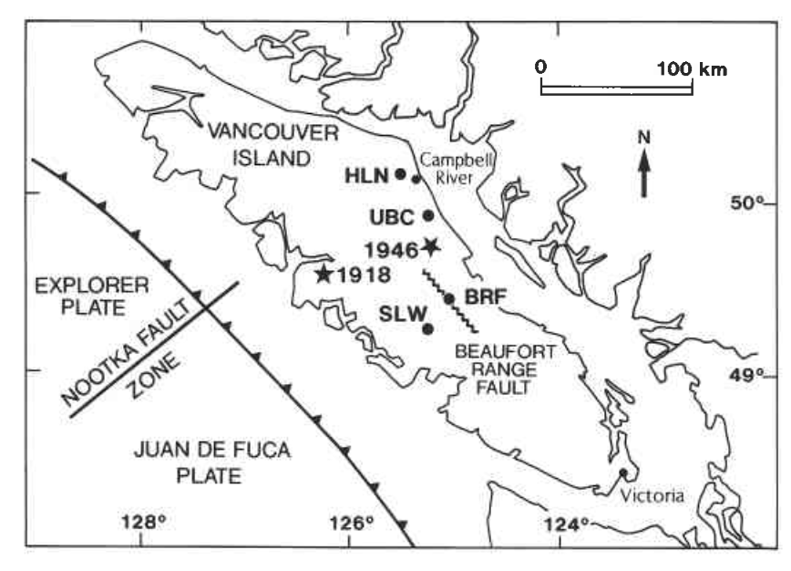

## Monitoring temporal change in conductivity in the central Vancouver Island region, an area with past large earthquakes

_D.R. Auld, S.E. Dosso, Douglas W. Oldenburg & LK Law_

[https://doi.org/10.1139/e92-052](https://doi.org/10.1139/e92-052)

## Summary

Our modelling study indicates a small but systematic yearly  decrease in conductivity from 1987 to 1990 localized in a conductive zone overlying the subducting Juan de Fuca Plate.

## Citation

Auld, D. R., Dosso, S. E., Oldenburg, D. W., & Law, L. K. (1992). Monitoring temporal change in conductivity in the central Vancouver Island region, an area with past large earthquakes. Canadian Journal of Earth Sciences, 29(4), 601–608. https://doi.org/10.1139/e92-052
